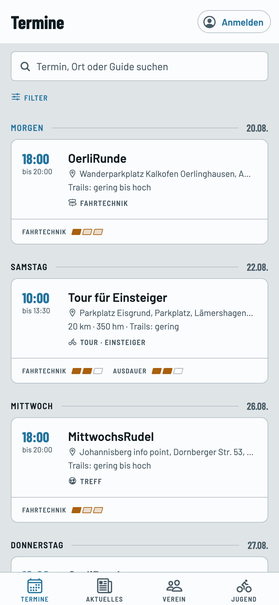
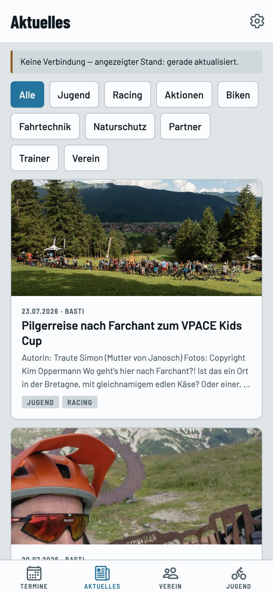
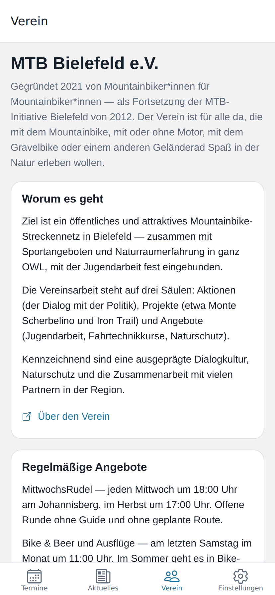
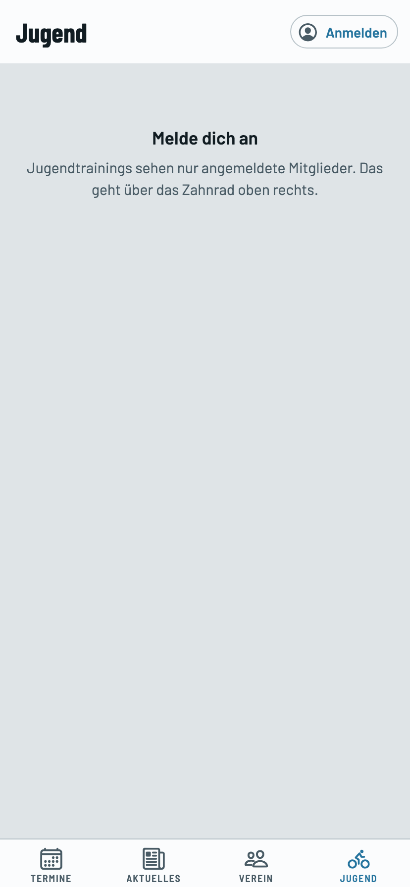
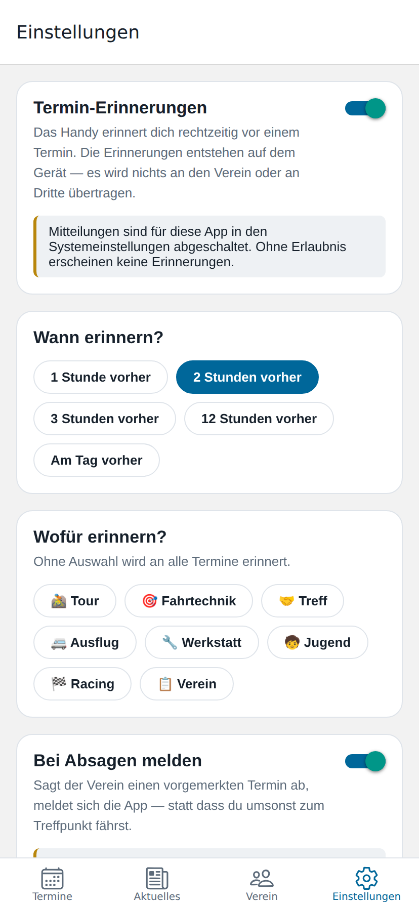
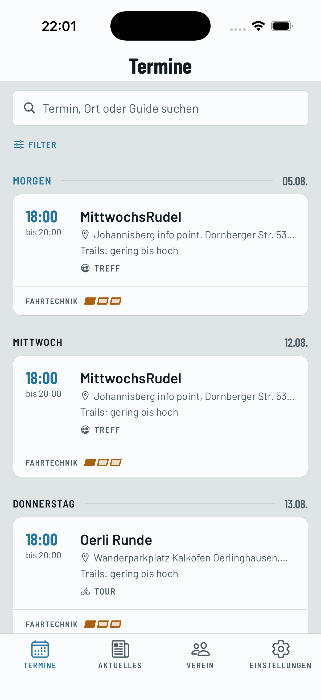
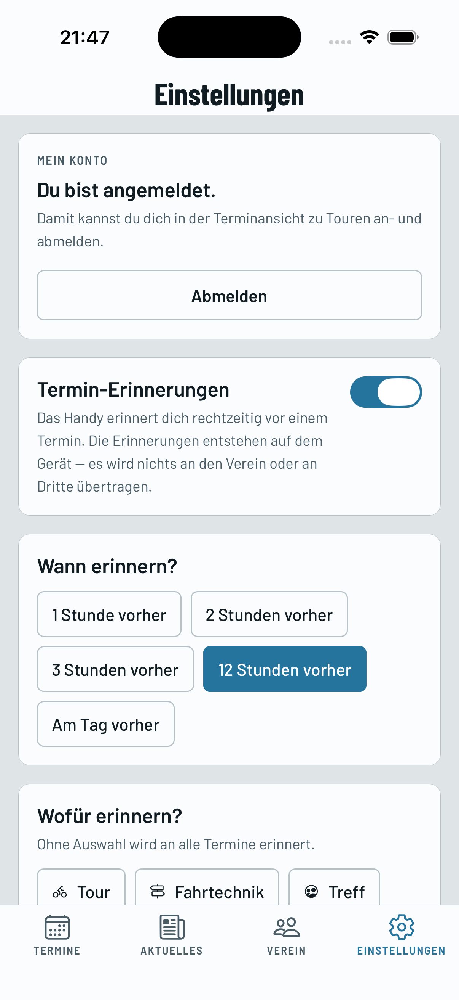
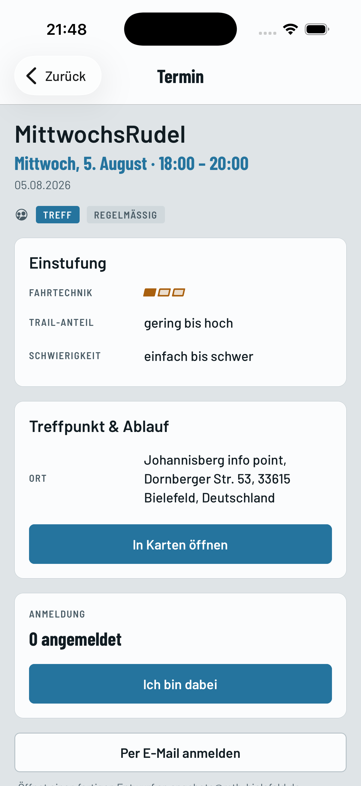
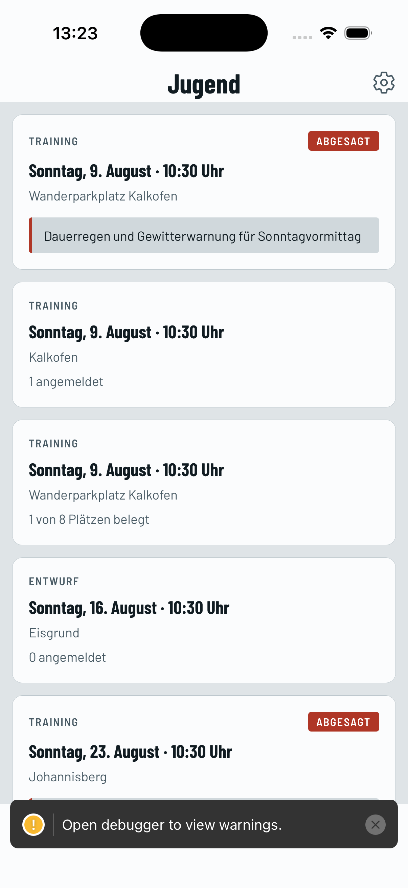

# Vereins-App

Die App zum [MTB Bielefeld e.V.](https://mtb-bielefeld.de) für iOS und Android.
Termine, Aktuelles und Vereinsinfos — aus den Daten, die der Verein ohnehin pflegt.

| Termine | Aktuelles | Verein | Jugend | Einstellungen |
| --- | --- | --- | --- | --- |
|  |  |  |  |  |

> Vier davon sind Reiter unten; **Einstellungen** liegt hinter dem Zahnrad
> oben rechts. Die Reiterleiste fasst nur vier Einträge — mit einem fünften
> steht dort „EINSTELLUN…", auf einem Gerät nachgemessen.

> Die Aufnahmen entstehen aus der **Web-Fassung** der App mit echten Daten aus
> dem Vereinskalender (`npm run vorschau`). Auf iOS und Android sehen Schriften,
> Schatten und die Reiterleiste etwas anders aus — Aufbau und Inhalt sind
> dieselben. Die leeren Bildflächen bei „Aktuelles" sind ein Nebeneffekt der
> Umgebung, in der die Aufnahmen entstanden: Dort hatte der Browser keinen
> direkten Netzzugang. Auf einem normalen Rechner sind die Bilder da.

Die Anmeldung als Mitglied und die Tourenanmeldung sind auf einem echten
iOS-System aufgenommen (iPhone 17 Pro, iOS 26.5):

| Nach dem Anmeldelink | Angemeldet | Zu einer Tour eintragen | Jugendtrainings |
| --- | --- | --- | --- |
|  |  |  |  |

## Worum es geht

Der Verein hat einen guten Kalender und eine gute Website. Was fehlt, ist die
Antwort auf die Frage, die sich vor jeder Ausfahrt stellt:

> **Was kann ich mit meinem Können in den nächsten Wochen mitfahren?**

Der Vereinskalender enthält diese Antwort bereits — sie steckt in den
Beschreibungen. Seit Jahren schreibt der Verein seine Angebote nach festem
Muster aus:

```
Euer Guide: Malte
Uhrzeit & Dauer: 10Uhr, ca. 3 Std
Abfahrtsort: Parkplatz Eisgrund
Ausdauer: ⭐/⭐⭐ ca. 22 km, 450hm, mittleres Tempo
Fahrtechnik: ⭐
Trail-Anteil: gering
Schwierigkeitsgrad: flowig
```

Die App liest das aus und macht daraus Filter. „Zeig mir alle Termine mit
höchstens zwei Sternen Fahrtechnik in den nächsten vier Wochen" ist damit eine
Frage von zwei Fingertipps — im Kalender-Abo ist sie unbeantwortbar.

## Was die App kann

- **Termine mit echten Filtern** — nach Fahrtechnik- und Ausdauer-Sternen, nach
  Art (Tour, Fahrtechnik, Treff, Ausflug, Werkstatt, Jugend, Racing, Verein),
  nach Erfahrungsstufe, nach Ladies-Only. Dazu Freitextsuche über Titel, Ort,
  Beschreibung und Guide.
- **Serientermine korrekt** — MittwochsRudel, Bike&Beer am letzten Samstag im
  Monat, Winterpausen und verschobene Einzeltermine inklusive.
- **Absagen sichtbar** — der Verein markiert sie im Titel, mal als
  `-ABGESAGT-`, mal als „(fällt witterungsbedingt leider aus!!)". Die App
  erkennt beides.
- **Erinnerungen** — das Handy meldet sich vor einem Termin und wenn ein
  vorgemerkter Termin abgesagt wird. Dafür sieht die App etwa alle drei Stunden
  im Hintergrund nach. Wann das tatsächlich geschieht, entscheidet das
  Betriebssystem: Android hält sich meist grob daran, iOS führt solche Aufträge
  oft nur in eigenen Zeitfenstern aus. Der Absage-Alarm ist deshalb ein Zusatz,
  keine Zusage — das sagt die App in den Einstellungen auch so.
- **Treffpunkt in der Karten-App** — ein Tipp, und die Navigation läuft.
- **Aktuelles mit Themenfilter** — alle rund 150 Beiträge der Website, nicht nur
  die neuesten. Filtern nach Thema (Racing, Jugend, Naturschutz, Fahrtechnik …),
  wie der Verein sie vergibt. Ein Tipp auf „Racing" zeigt die Rennberichte,
  sonst nichts.
- **Verein & Mitmachen** — Angebote, Beiträge, Mitglied werden, Kontakt.
- **Anmelden ohne Passwort** — wer im Verein ist, gibt seine Adresse ein und
  bekommt einen Link per Mail. Beim ersten Mal braucht es zusätzlich einen
  Einladungscode; danach genügt die Adresse. Wer sich nie anmeldet, sieht die
  App wie bisher — nichts drängt sich auf.
- **Zu Touren eintragen** — die Terminansicht zeigt, wie viele Plätze belegt
  sind, und ein Tipp trägt ein oder wieder aus. Der Mail-Knopf bleibt daneben
  bestehen: Ohne Netz ist der Mail-Entwurf die einzige Anmeldung, die noch geht.
- **Funktioniert ohne Empfang** — im Wald zählt, was auf dem Gerät liegt. Auch
  ohne den Vereinsserver: Termine, Filter, Aktuelles und Erinnerungen kommen
  ohne ihn aus. Dann fehlt nur die Belegung.

## Woher die Daten kommen

Die App fragt zwei öffentliche Quellen direkt ab:

| Quelle | Adresse |
| --- | --- |
| Termine | öffentlicher Google-Kalender „MTBie Angebote" (ICS) |
| Aktuelles | die Beitragsseiten von mtb-bielefeld.de (RSS als Rückfallebene) |

Für die Beiträge werden die HTML-Seiten gelesen statt des RSS-Feeds. Der Feed
kann zwei Dinge nicht: Er nennt zu keinem Beitrag das Thema, und er liefert nur
die 30 neuesten ohne Möglichkeit zu blättern. Beides steckt in den
Übersichtsseiten — das Thema sogar maschinenlesbar in der CSS-Klasse
(`<div class="entry tag-Jugend/ tag-Racing/">`). Scheitert das Auswerten, etwa
nach einem Umbau der Website, greift der Feed als Rückfallebene.

**Es gibt keinen Server und keine laufenden Kosten.** Der Verein pflegt weiter
nur seinen Google-Kalender und seine Website — die App zieht automatisch nach.
Beide Adressen stehen in [`src/config.ts`](src/config.ts).

Wird die App größer und ein eigenes Backend sinnvoll, ist
[`src/data/repository.ts`](src/data/repository.ts) die einzige Stelle, die sich
ändert. Bildschirme, Filter und Erinnerungen bleiben unberührt.

### Datenschutz

Die App sammelt nichts. Es gibt keine Konten, keine Analyse, keine Werbung.
Erinnerungen entstehen **auf dem Gerät** — es wird kein Gerätekennzeichen an
den Verein oder an Dritte übertragen, und der Verein muss keinen Push-Dienst
betreiben. Abgerufen werden nur die beiden öffentlichen Adressen oben.

## Loslegen

Vorausgesetzt sind Node 20 oder neuer und die
[Expo-Go-App](https://expo.dev/go) auf dem Handy.

```bash
npm install
npm start          # QR-Code mit Expo Go scannen
```

Weitere Befehle:

```bash
npm test           # Tests (ohne Gerät, reines Node)
npm run typecheck  # TypeScript prüfen
npm run android    # auf Android-Gerät/Emulator starten
npm run ios        # auf iOS-Gerät/Simulator starten (macOS nötig)
npm run vorschau   # Web-Fassung bauen und Screenshots aufnehmen
```

### Auf dem Mac testen

Vier Wege, vom schnellsten zum gründlichsten:

**1. Auf dem eigenen Handy (kein Xcode nötig, zwei Minuten)**

```bash
npm install
npm start
```

Expo Go aus dem App Store laden, den QR-Code mit der Kamera scannen. Handy und
Mac müssen im selben WLAN sein. Für den Alltag der beste Weg — Änderungen sind
sofort auf dem Gerät sichtbar.

Eine Einschränkung: Expo Go bringt nur die Standard-Module mit. Erinnerungen
lassen sich darin eingeschränkt testen, die Hintergrund-Aktualisierung gar nicht.

**2. Im Browser (am schnellsten zum Draufschauen)**

Braucht **zwei Terminals**:

```bash
npm run proxy     # Terminal 1 — muss laufen bleiben
npm start         # Terminal 2, dann "w" drücken
```

Dann `http://localhost:8081` im Browser.

Der Vermittler in Terminal 1 ist nicht optional: Weder der Google-Kalender noch
mtb-bielefeld.de senden die Kopfzeile `Access-Control-Allow-Origin`, weshalb ein
Browser den direkten Zugriff verweigert (CORS). **Ohne ihn bleibt die
Terminliste leer.** `npm run proxy` reicht die Feeds mit der fehlenden Kopfzeile
weiter; die App erkennt selbst, dass sie im Browser läuft, und fragt dort an.

Auf iOS und Android gibt es diese Beschränkung nicht — dort lädt die App immer
direkt, auch in der veröffentlichten Fassung. Der Vermittler ist reines
Entwicklungswerkzeug.

**3. Im iOS-Simulator (braucht Xcode, ca. 8 GB)**

```bash
npm run ios
```

Xcode aus dem App Store, dann einmalig `xcode-select --install`. Beim ersten
Aufruf wird das native Projekt erzeugt und übersetzt — das dauert.

**4. Als eigenständige App auf dem Gerät (für Erinnerungen und Hintergrundlauf)**

```bash
npx expo run:ios --device
```

Nur so laufen Termin-Erinnerungen und die Hintergrund-Aktualisierung wie später
im Store. Nötig für den Test, der noch aussteht. Zum Auslösen des
Hintergrundlaufs ohne Wartezeit hilft
`BackgroundTask.triggerTaskWorkerForTestingAsync()`.

**Ohne Handy und ohne Xcode:** `npm run vorschau` baut die Web-Fassung, nimmt
Screenshots auf und meldet Render-Fehler. Kein Ersatz für einen Gerätetest, aber
es findet Dinge, die `expo export` nicht sieht — siehe unten.

#### Was in Expo Go nicht läuft

Expo Go bringt nur die Standard-Module mit. Termine, Filter, Aktuelles und die
Vereinsseite lassen sich damit vollständig testen — **Erinnerungen und die
Hintergrund-Aktualisierung nicht**. `expo-notifications` warnt beim Start
selbst, dass es in Expo Go nur eingeschränkt funktioniert und ein
Development Build nötig ist; die Hintergrund-Aktualisierung braucht
Einträge in der nativen Projektdatei, die Expo Go nicht je App bereitstellen
kann.

Für diese beiden Bereiche führt kein Weg an Variante 4 vorbei.

### Prüfliste für den Gerätetest

Was Tests und Vorschau nicht abdecken können — abzuarbeiten vor der
Veröffentlichung:

**Termine**
- [ ] Die Liste zeigt dieselben Termine wie der Vereinskalender, mit denselben
      Uhrzeiten.
- [ ] Ein Termin nach der Zeitumstellung Ende Oktober steht weiterhin zur
      richtigen Ortszeit (MittwochsRudel um 17:00, nicht 16:00 oder 18:00).
- [ ] Ein abgesagter Termin ist als solcher gekennzeichnet.
- [ ] „In Karten öffnen" landet am richtigen Treffpunkt.

**Offline** — der Alltag im Wald
- [ ] Flugmodus einschalten, App neu starten: Die Termine sind noch da.
- [ ] Der Hinweis auf das Alter der Daten erscheint und stimmt.
- [ ] Nach unten ziehen meldet einen Fehler, ohne die Liste zu leeren.

**Erinnerungen** (nur im Development Build)
- [ ] Einschalten fragt nach der Erlaubnis; Ablehnen lässt den Schalter aus.
- [ ] Eine Erinnerung erscheint zur erwarteten Zeit vor dem Termin.
- [ ] Vorlaufzeit ändern verschiebt die Erinnerung entsprechend.
- [ ] Erinnerungen ausschalten entfernt die vorgemerkten Meldungen.

**Hintergrund-Aktualisierung** (nur im Development Build)
- [ ] `BackgroundTask.triggerTaskWorkerForTestingAsync()` löst einen Lauf aus.
- [ ] Wird ein vorgemerkter Termin im Kalender abgesagt, kommt die Meldung.
- [ ] Bei abgeschalteten Erinnerungen lädt der Hintergrundlauf nichts.

**Darstellung**
- [ ] Dunkles Farbschema auf beiden Plattformen.
- [ ] Große Systemschrift bricht das Layout nicht.
- [ ] Lange Termintitel und lange Ortsangaben werden sauber abgeschnitten.

> **Hinweis zu `npm install`:** Das Projekt enthält eine `.npmrc` mit
> `legacy-peer-deps=true`. Grund ist eine Unstimmigkeit zwischen den
> React-Versionen, die Expo SDK 57 und dessen Entwicklerwerkzeuge verlangen —
> ohne die Einstellung bricht jede Installation ab. Sobald Expo das behebt, kann
> die Datei weg.

### Veröffentlichen

Für den Weg in App Store und Play Store wird
[EAS Build](https://docs.expo.dev/build/introduction/) genutzt. Nötig sind ein
Apple-Developer-Konto (99 $/Jahr) und ein Google-Play-Konto (25 $ einmalig) —
beide sollten dem Verein gehören, nicht einer Privatperson.

## Aufbau

```
app/                     Bildschirme (expo-router: Dateiname = Adresse)
  (tabs)/index.tsx         Termine — Hauptbildschirm
  (tabs)/news.tsx          Aktuelles
  (tabs)/verein.tsx        Verein & Mitmachen
  (tabs)/einstellungen.tsx Erinnerungen
  termin/[id].tsx          Termin-Detailansicht
  news/[id].tsx            Beitrag-Detailansicht

src/
  config.ts              Adressen der Datenquellen — hier wird getauscht
  domain/types.ts        Datentypen, unabhängig von iCal und RSS
  data/
    ical/                Kalender einlesen samt Serienterminen
    rss/                 News-Feed einlesen
    parse/               Beschreibungen auswerten und einordnen
    repository.ts        Abruf + Zwischenspeicher (Umstiegspunkt für ein Backend)
  features/events/       Filter, Aufbereitung, Terminkarte
  notifications/         Erinnerungen (Planung getrennt von der System-Anbindung)
  content/club.ts        Vereinstexte — von Hand gepflegt
  ui/                    Farbschema und wiederverwendete Bausteine

tests/                   Tests, u.a. gegen echte Kalenderdaten
```

## Der Vereinsserver

Für alles außer Anmeldung und Tourenanmeldung braucht die App **keinen**
eigenen Server — Termine und Beiträge holt sie direkt bei Google und der
Website. Der Server ist ein Zusatz. Fällt er aus, fehlt die Belegung; der Rest
bleibt.

Er liegt unter `api/` (Fastify, Postgres, rohes SQL ohne ORM) und läuft für die
Entwicklung vollständig in Docker:

```bash
cp betrieb/.env.beispiel betrieb/.env
docker compose -f betrieb/docker-compose.yml up --build
```

Vier Container: Postgres, die API, Caddy als Proxy davor und Mailpit als
Postfach daneben. Danach ist die API über `http://localhost` erreichbar und
jede verschickte Mail unter `http://localhost:8025` zu sehen — nichts geht
nach draußen. `betrieb/LIESMICH.md` führt den Anmeldeablauf in fünf Schritten
von Hand vor.

Ein Wort zur Anmeldung: **Es gibt keine Passwörter.** Wer sich anmeldet,
bekommt einen Link per Mail. Die App hält danach zwei Token — eines gilt 15
Minuten und lebt nur im Arbeitsspeicher, das andere gilt 60 Tage und liegt im
Schlüsselbund des Geräts. In der Datenbank stehen ausschließlich Hashes.

### Jugendtrainings

Die Trainings für die Jugend entstehen spontan — meist sonntags um 10:30, an
wechselnden Orten — und liefen bisher über eine WhatsApp-Gruppe. Wer nicht
drin war, erfuhr nichts; niemand wusste verlässlich, wie viele Kinder kommen.

Seit August kann die API das. Zwei Phasen, und der Übergang ist eine
menschliche Entscheidung:

```
Guide legt einen Entwurf an     nur für Guides sichtbar
  → Mail an alle Guides         „Sonntag 10:30 Oerlinghausen — kannst du?"
  → Guides sagen zu oder ab
  → der Guide sieht, wer kann, und entscheidet selbst
       ↓ veröffentlichen
  sichtbar für alle Mitglieder  Eltern melden ein bis zwei Kinder an
       ↓ Absage jederzeit
  → Mail an alle Angemeldeten, mit Grund
```

Kein Schwellenwert im Code: Ob zwei Guides für acht Kinder reichen, hängt an
Strecke, Alter und Wetter — das weiß nur ein Mensch.

**Die heikelste Entscheidung betrifft Kinder.** Gespeichert wird immer der
volle Name, aber die Eltern wählen **je Kind**, was andere Vereinsmitglieder
davon sehen: Vorname, beides oder nichts. Guides sehen immer Vor- und
Nachname, weil sie die Aufsicht haben — bei einem Sturz muss jemand wissen,
wer da liegt. Dreißig Tage nach dem Training werden die Namen gelöscht.

Guides ernennt man auf dem Server, nicht über eine Oberfläche:

```bash
docker compose -f betrieb/docker-compose.yml exec api \
  npm run rolle:setzen -- vorname.nachname@example.org guide
```

> **In der App ist davon noch nichts zu sehen.** Die Endpunkte stehen und
> sind geprüft, der Bereich „Jugend" kommt mit dem nächsten Plan. Bis dahin
> lässt sich das Ganze nur mit `curl` bedienen.

Warum das so gebaut ist und woran man sich beim Ändern die Finger verbrennt,
steht in **[docs/ARCHITEKTUR.md](docs/ARCHITEKTUR.md)**.

## Über die Tests

240 Tests, die ohne Gerät und ohne Netz laufen — in einem Bruchteil einer
Sekunde. Dazu 223 Tests der API (`cd api && npm test`, gegen ein lokales
Postgres). Nennenswert:

- **Echte Daten als Prüfstein.** `tests/fixtures/kalender-auszug.ics` ist ein
  eingefrorener Auszug des Vereinskalenders — bewusst mit den kniffligen Fällen:
  einer Serie mit 22 Ausnahmeterminen und einem Einzeltermin, der verschoben
  *und* abgesagt wurde.
- **Zeitumstellung.** Ein Test prüft, dass eine Serie über den Wechsel von
  Winter- auf Sommerzeit hinweg um 19:00 Uhr Ortszeit bleibt, obwohl sich der
  Zeitpunkt in UTC um eine Stunde verschiebt. Genau hier verrechnen sich
  Kalender-Umsetzungen typischerweise.
- **Zwei echte Fehler dokumentiert.** Beide wurden beim Abgleich mit den
  Kalenderdaten gefunden und sind als Test festgehalten:
  - „Die Route, das **Profil** und der Schwierigkeitsgrad ergeben sich spontan"
    stufte 183 Termine als Könner-Termine ein — das Muster für „Profi" hatte
    keine saubere Wortgrenze.
  - „Trail-Anteil" wurde in 393 von 393 Fällen verschluckt, weil der Bindestrich
    im Beschriftungsmuster fehlte.

Bei den anderen Angaben liegt der Erfassungsgrad gemessen an den echten Daten
bei 100 % — die einzigen Ausreißer sind die Scherzeinträge der Bike&Beer-Termine
(„Ausdauer: 🌭", „Fahrtechnik: 🍺"), die korrekt keine Sternebewertung ergeben.

### Warum `npm run vorschau` dazugehört

Tests und `expo export` beweisen, dass sich die App übersetzen und bündeln
lässt. Sie beweisen **nicht**, dass sie etwas Sinnvolles anzeigt. Genau
dazwischen liegen Fehler, die sonst erst auf dem Gerät auffallen.

Der erste Lauf der Vorschau hat prompt einen gefunden: Die Terminkarten hatten
weder Hintergrund noch Rahmen, und Uhrzeit und Titel standen untereinander statt
nebeneinander. Ursache war `Link asChild` — es ersetzt das äußere Element, wobei
dessen Stil verlorengeht. Tests, Typprüfung und Bündeln waren dabei die ganze
Zeit grün.

### Und warum `npm run rauchprobe` dazugehört

Die Testsuite stellt `fetch` selbst — und eine Attrappe antwortet immer so, wie
der Schreibende es erwartet hat. `npm run rauchprobe` lässt stattdessen
**dieselben Module, die auf dem Telefon laufen**, gegen den laufenden
Docker-Aufbau arbeiten: Einladungscode, echte Mail aus Mailpit, Link einlösen,
Konto abfragen, zu einem echten Termin an- und abmelden.

Auch das hat sofort etwas gefunden, das siebzehn grüne Tests nicht sahen: Der
API-Zugang setzte `content-type: application/json` auch ohne Anfragekörper.
Fastify weist so etwas mit 400 ab, noch bevor das Token geprüft wird — die
Tourenanmeldung hätte auf keinem Gerät je funktioniert.

Vier Stufen, und jede sieht etwas, das die davor nicht sehen kann:

| Befehl | Sieht | Ist blind für |
| --- | --- | --- |
| `npm test` | Rechenlogik | alles, was ein Gerät oder einen Server braucht |
| `npm run typecheck` | Typfehler | ob es sich sinnvoll verhält |
| `npm run vorschau` | ob die Oberfläche etwas darstellt | ob sie mit der API zusammenspielt |
| `npm run rauchprobe` | die echten Module gegen die echte API | React Native, Bildschirme, angetippte Links |

Was keine der vier sieht, ist ein angetippter Link. Genau dort steckte der
letzte Fehler: Der Anmeldelink landete auf expo-routers englischem
Notbildschirm „Unmatched Route", weil die Route dafür fehlte. Die Anmeldung
gelang im Hintergrund — sichtbar war eine Fehlerseite in einer fremden
Sprache. Gefunden hat es erst der Simulator.

## Was noch offen ist

- **Jugendtrainings in der App.** Die API kann sie vollständig, die App zeigt
  sie noch nicht — Bereich „Jugend", Anmeldeformular, Guide-Ansicht, dazu ein
  Teilen-Knopf für die WhatsApp-Gruppe und Universal Links. Der Plan dafür
  liegt unter `docs/superpowers/plans/2026-08-05-jugendtrainings-app.md`.
- **Der Vereinsserver läuft nur lokal.** Domain, Zertifikat, ein Mailanbieter
  mit Sitz in der EU samt SPF, DKIM und DMARC, SSH-Härtung, Firewall und
  Backups mit regelmäßiger Rücksicherungsprobe stehen noch aus. Die vier
  Stellen, die sich dafür ändern müssen, sind im Kopf von
  `betrieb/docker-compose.yml` aufgezählt. Dazu die rechtlichen Punkte
  (Verzeichnis von Verarbeitungstätigkeiten, Auftragsverarbeitungsvertrag,
  neue Datenschutzerklärung) — und die Frage, die noch niemand beantwortet
  hat: **Wer betreibt das auf Dauer?**
- **Erinnerungen auf einem echten Gerät.** Anmeldung und Tourenanmeldung sind
  auf dem Simulator geprüft; Erinnerungen und Hintergrund-Aktualisierung
  bisher nur als Rechenlogik. Die App verzichtet bewusst auf die
  Push-Berechtigung — lokale Erinnerungen sollten sie nicht brauchen, geprüft
  ist das aber nie. Zum Auslösen ohne Warten hilft
  `BackgroundTask.triggerTaskWorkerForTestingAsync()`.
- **Symbole auf echten Geräten ansehen.** App-Symbol und Startbild stammen aus
  dem Vereinslogo (siehe unten), sind aber bisher nur als Bilddatei geprüft —
  nicht auf einem Startbildschirm.
- **Vereinstexte pflegen.** `src/content/club.ts` ist von Hand geschrieben
  (Stand August 2026). Ändern sich die Beiträge, muss es dort nachgezogen
  werden — jeder Abschnitt verlinkt deshalb auf die Website als verbindliche
  Quelle.

## Das Logo

Das Original liegt als Vektordatei unter
[`assets/logo/`](assets/logo/MTB_Bielefeld_EV_Logo.eps). Alle Symbole der App
werden daraus erzeugt:

```bash
python3 tools/logo-assets.py     # braucht Ghostscript, Pillow, numpy, scipy
```

Läuft nur, wenn der Verein sein Logo ändert. Drei Eigenheiten der Vorlage nimmt
das Skript dabei ab:

- Die Datei ist eine **DOS-EPS** mit Binärkopf — Ghostscript bekommt nur den
  PostScript-Teil zu sehen.
- Sie stammt von einer **Aufkleber-Vorlage** und enthält eine magentafarbene
  Schneidekontur für die Druckerei. Die gehört nicht ins Logo und wird
  weggeschnitten.
- Turm, Hügel und Trail sind **Aussparungen in der blauen Fläche**, keine weiße
  Farbe. Wer das Emblem naiv freistellt, bekommt Löcher statt Zeichnung.

### Das Vereinsblau

Verbindlich ist die Druckdefinition des Vereins — **C 90 | M 50 | Y 20 | K 5**,
neben Schwarz die einzige Farbe im Logo. Die Logodatei enthält genau diese Werte
(nachgemessen: C 90,6 M 52,9 Y 18,8 K 3,9; die Abweichung stammt aus der
8-Bit-Speicherung).

Für den Bildschirm gibt es daraus kein einzelnes richtiges RGB — es hängt am
Farbprofil:

| Weg | Ergebnis | Abstand zur Umrechnung |
| --- | --- | --- |
| **ICC-Umrechnung der Druckfarbe** | **`#25749E`** | — |
| so rendert Ghostscript die Logodatei | `#076C9B` | ΔE 4,6 |
| Stylesheet der Vereinswebsite | `#00679A` | ΔE 7,9 |
| Faustformel ohne Farbmanagement | `#1879C2` | ΔE 18,8 |

Die App nutzt die **ICC-Umrechnung**: Sie ist der einzige Wert, der sich
unmittelbar aus der offiziellen Druckdefinition ergibt statt aus einer
Wiedergabe davon. Die ersten drei liegen ohnehin in derselben Farbfamilie.

Die naheliegende Faustformel scheidet aus: Mit ΔE über 18 wäre das ein sichtbar
helleres, bunteres Blau.

Geändert wird die Farbe an genau einer Stelle — [`src/brand.ts`](src/brand.ts).
Danach `python3 tools/logo-assets.py`, damit Symbole und Startbild nachziehen.

Nachrechnen lässt sich das mit [`tools/farbe-pruefen.py`](tools/farbe-pruefen.py).

## Sicherheit

Automatisch laufen CodeQL (statische Analyse, wöchentlich und bei jedem Pull
Request), Dependabot und eine Schwachstellenprüfung der Abhängigkeiten in der CI.
Stand aktuell: **0 bekannte Schwachstellen**.

Wie eine Lücke zu melden ist und was die App überhaupt angreifbar macht, steht in
[SECURITY.md](SECURITY.md).

## Lizenz

Der Quelltext steht unter der [MIT-Lizenz](LICENSE) — andere Vereine dürfen ihn
gerne übernehmen.

Name, Logo und die Vereinstexte des MTB Bielefeld e.V. sind davon **nicht**
erfasst. Was genau frei ist und was nicht, steht in [HINWEISE.md](HINWEISE.md);
dort finden sich auch die Angaben zum Datenschutz.
